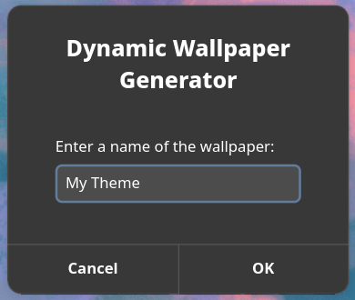
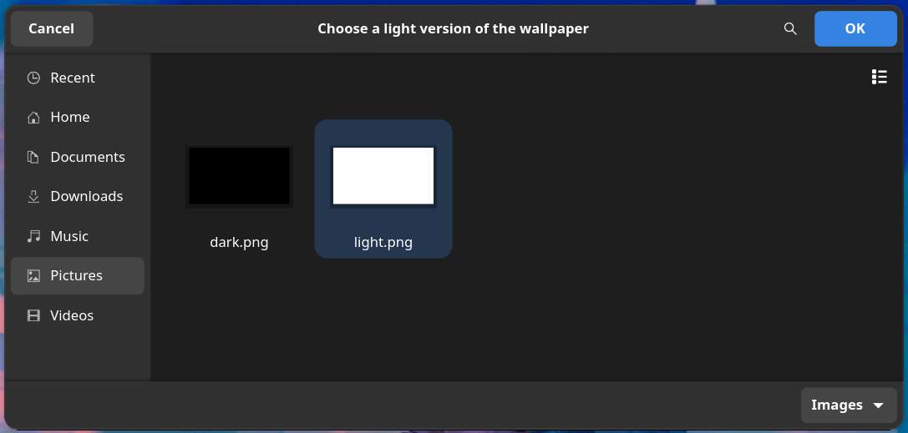
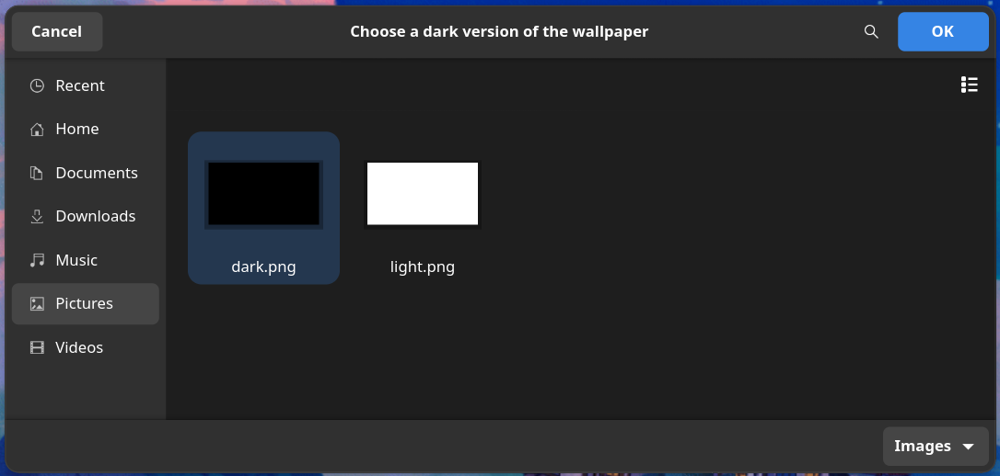
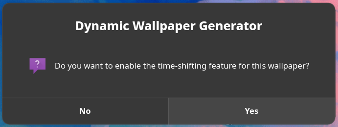
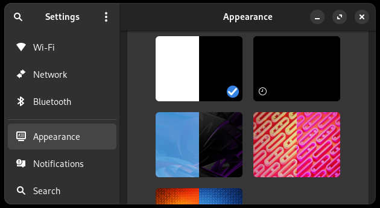

# Dynamic Wallpaper Generator

[](https://github.com/Kir-Antipov/dynwall/releases/latest)
[](https://github.com/Kir-Antipov/dynwall/blob/HEAD/LICENSE.md)

`dynwall` is a simple tool that helps you quickly generate dynamic wallpapers for popular desktop environments like KDE Plasma or GNOME from two images of your choice. It doesn't require installation and can be used both as a graphical utility to achieve desired results easily and quickly, and as a CLI for better fine-tuning and automation.

----

## Quick Start

In order to run this tool, clone the repo and execute the `dynwall` script:

```bash
git clone https://github.com/Kir-Antipov/dynwall
cd dynwall
./dynwall
```

Alternatively, if you don't want to keep the script after its execution, for example, if you only need to generate a single wallpaper, you can achieve the same results with this one-liner:

```bash
curl -Ls https://github.com/Kir-Antipov/dynwall/blob/HEAD/dynwall?raw=true | bash -s
```

While the script is running, simply follow its instructions:

1) Enter a name for your wallpaper in the first popup.

    

2) After that, choose a light version of your wallpaper in the file dialog.

    

3) Then, choose a dark version of your wallpaper in the newly popped file dialog.

    

4) Specify whether you want to enable the time-shifting feature for your wallpaper *(i.e., it will gradually change from its light version to the dark one and back throughout the day)*.

    

5) That's all! The wallpaper has been successfully generated, and you can select it in your system settings.

    

Here's a helpful list of features supported by DEs that `dynwall` is currently aware of:

|            | Dynamic Wallpapers | GIF Wallpapers | Time-Shifting Wallpapers |
| ---------- |:------------------:|:--------------:|:------------------------:|
| KDE Plasma |         ✅         |       ✅       |            ❌            |
| GNOME      |         ✅         |       ❌       |            ✅            |

----

## Usage

```
Usage: ./dynwall [<options>]

Generate dynamic wallpapers.

Examples:
  ./dynwall
  ./dynwall -n "My Theme" -l "light.png" -d "dark.png" --no-time-shifting
  ./dynwall -n "My Theme" -l "https://example.com/light.png" -d "dark.png" -t
  sudo -E ./dynwall --style terminal --force

Options:
  -h, --help                     Display this help text and exit.
  -l, --light-image <uri>        Set a URI of the light wallpaper image.
  -d, --dark-image <uri>         Set a URI of the dark wallpaper image.
  -i, --id <id>                  Set an identifier for the wallpaper.
  -n, --name <name>              Set a name for the wallpaper.
  -t, --time-shifting            Enable time-shifting for the wallpaper.
  --no-time-shifting             Disable time-shifting for the wallpaper.
  -o, --output-directory <path>  Set a directory to save the wallpaper.
  -f, --force                    Allow overwriting existing files.
  -s, --style <style>            Choose a dialog style: KDE, GNOME, or TERMINAL.
  -a, --author <author>          Specify an author of the wallpaper.
  -e, --email <name>             Specify an email of the author of the wallpaper.
  -c, --license <license>        Specify a license for the wallpaper.
```

Of course, there's no need to use that pesky GUI if you don't want to! Just provide all the necessary information upfront, and you're good to go. Alternatively, you can specify the `--style terminal` flag, so `dynwall` will ask all its questions within the terminal without creating dialog windows.

Here are a few benefits of using CLI over the GUI routine:

1) You can specify URLs instead of file paths for your images. So, if those are hosted somewhere, there's no need to download them manually only to stuff them into `dynwall`.
2) You can provide values for the `author`, `email`, and `license` options if you want to share the wallpaper with somebody.
3) You can allow overwriting existing files via the `--force` flag, which is disabled by default so GUI users won't accidentally delete something important.
4) If you run `dynwall` via `sudo -E` *(mind the `-E`; it's important for `dynwall` to know the desktop environment it's currently in)*, you can create a global wallpaper instead of a local one. Global wallpapers are accessible to all users, unlike local ones, which are only available to their respective owners.

----

## License

Licensed under the terms of the [MIT License](https://github.com/Kir-Antipov/dynwall/blob/HEAD/LICENSE.md).
